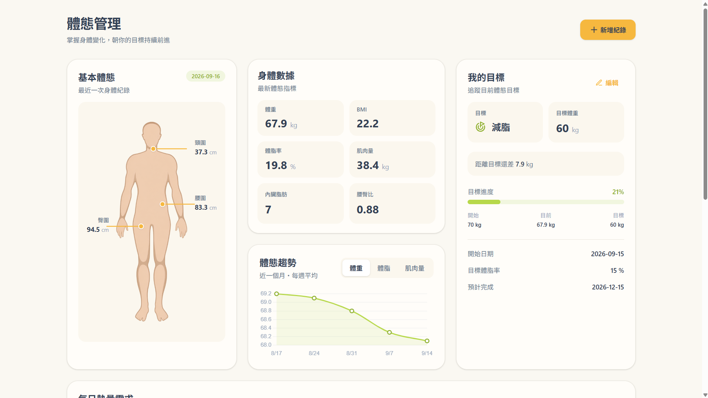
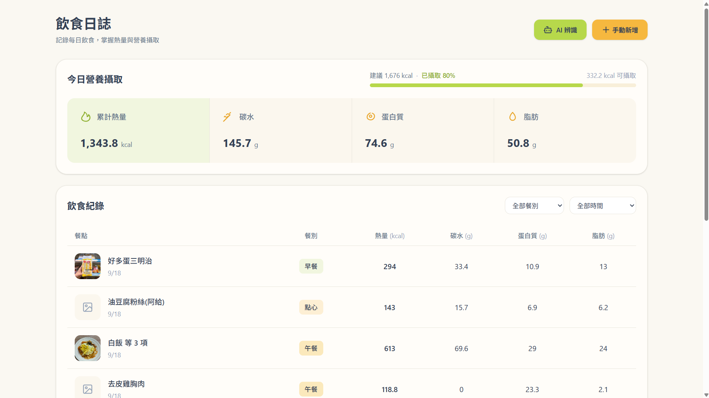
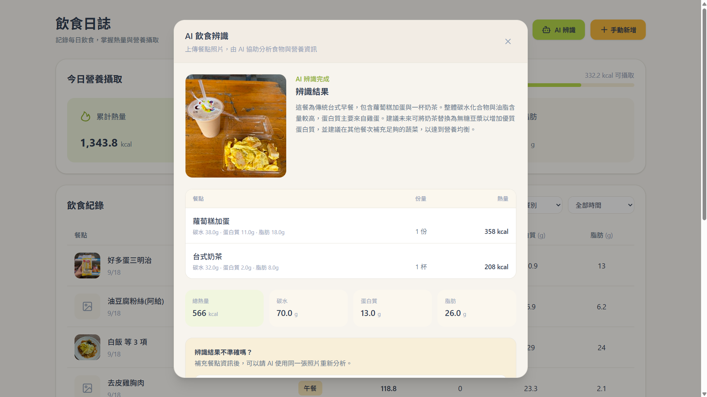

# HappyEat

> AI-powered diet and body management platform built with Vue.js, ASP.NET Core Web API, MSSQL, and Gemini API.

HappyEat is a health management platform designed to simplify daily diet tracking and body data management.

This repository focuses on the **Body Management** and **Food Diary** modules, combining body data visualization, nutrition tracking, personalized calorie recommendations, and AI-assisted food recognition.

---

## Preview

### Body Management

Track body measurements, visualize body changes, and monitor personal goal progress.



### Food Diary

Track daily calorie and macronutrient intake with meal records and personalized calorie recommendations.



### AI-Assisted Food Recognition

Upload a meal photo and let Gemini analyze food items and nutrition information. Users can review the results, provide additional context for re-analysis, and adjust the data before saving.



---

## Key Features

### AI-Assisted Food Recognition

- Upload meal photos for AI-powered food recognition
- Analyze calories and macronutrients with Gemini API
- Prioritize integrated convenience-store nutrition data when applicable
- Provide additional context and request AI re-analysis
- Review and manually adjust AI-generated results before saving
- Automatically clean up unused uploaded images

### Food Diary

- Create, edit, delete, and view meal records
- Search food and drink nutrition data
- Automatically calculate nutrition based on quantity
- Track calories, carbohydrates, protein, and fat
- Filter meal records by meal type and date
- Display meal photos and nutrition details
- Summarize daily nutrition intake
- Calculate personalized recommended daily calories

### Body Management

- Record weight, body fat, muscle mass, waist size, and other body measurements
- Calculate BMI, BMR, and TDEE
- Visualize body measurement data
- Track recent body trends
- Manage weight goals and progress
- Calculate recommended calorie intake based on body data and user goals

---

## Tech Stack

### Frontend

- Vue 3
- JavaScript
- Tailwind CSS
- Axios
- Vue Router
- Chart.js / vue-chartjs

### Backend

- C#
- ASP.NET Core Web API (.NET 10)
- Entity Framework Core (Database-First)
- RESTful API

### Database

- Microsoft SQL Server

### AI Integration

- Google Gemini API (Multi-modal Vision)
- Structured JSON Output (JSON Schema)
- Resilient Sequential Model Fallback & Timeout Control

---

## AI Recognition Workflow

```text
Upload Meal Photo
       ↓
Save FoodImage
       ↓
Gemini AI Analysis
       ↓
Display Recognition Result
       ↓
Need Correction?
       │
       ├── Yes → Provide Additional Context
       │              ↓
       │       Gemini Re-analysis
       │              ↓
       └────────── Review Result
                      ↓
               Manual Adjustment
                      ↓
               User Confirmation
                      ↓
               Save FoodRecord
```

AI-generated results are **not saved directly**.

HappyEat uses a **Human-in-the-loop** approach. Users can review the initial analysis, provide additional context for re-analysis, manually adjust the results, and save the record only after confirmation.

---

## Implementation Highlights

### Human-in-the-loop AI Design

Instead of treating AI output as the final result, HappyEat separates **AI analysis** from **record creation**.

This allows users to verify food items, quantities, and nutrition information before the data becomes part of their food diary.

### Convenience-Store Nutrition Matching

During development, AI-generated nutrition values for packaged convenience-store foods were sometimes inaccurate.

To improve reliability, public nutrition information for selected convenience-store products is integrated into the backend analysis process. When applicable, known nutrition data is prioritized during AI analysis.

### Food Image Lifecycle Management

Uploaded meal images are managed independently from food records.

```text
Upload Image
     ↓
AI Recognition
     │
     ├── Failed / Cancelled → Delete unused image
     │
     └── Confirmed
             ↓
        Save FoodRecord
             ↓
          Keep image
```

This prevents unused image records and files from remaining after failed or cancelled recognition.

### Dynamic Nutrition Calculation

Food and drink search results provide base nutrition values. Nutrition values are recalculated according to the quantity selected by the user.

```text
Nutrition = Base Nutrition × Quantity
```

Meal-level calories and macronutrients are then calculated from all food record items.

### Personalized Recommended Calories

Body Management and Food Diary are connected through the user's body data and personal goal.

```text
User Profile
     +
Latest Body Record
     ↓
BMR
     ↓
TDEE
     +
Active User Goal
     ↓
Recommended Daily Calories
```

Current goal adjustment:

```text
Fat Loss    → TDEE - 300 kcal
Maintenance → TDEE
Muscle Gain → TDEE + 300 kcal
```

---

## System Architecture

```text
Vue 3 Frontend
       ↓
API Services / Axios
       ↓
ASP.NET Core Web API
       ↓
Service Layer
       ↓
Entity Framework Core
       ↓
Microsoft SQL Server

        +

Meal Image
    ↓
FoodImage API
    ↓
Gemini Service
    ↓
Gemini API
    ↓
Nutrition Analysis
```

### Frontend Architecture

The frontend separates UI components, reusable stateful logic, and API communication through Vue components, composables, and service modules.

```text
Views / Components
        ↓
    Composables
        ↓
   API Services
        ↓
      Axios
        ↓
ASP.NET Core Web API
```

---

## Database Design

Main entities used in the implemented modules:

```text
Users
 ├── BodyRecords
 ├── UserGoals
 ├── FoodImages
 └── FoodRecords
          │
          └── FoodRecordItems
                 ├── Food
                 └── Drink
```

### Key Relationships

- One user can have multiple body records
- One user can have multiple food records
- One food record can contain multiple food record items
- A food record can optionally reference one uploaded image
- A food record item can reference either Food or Drink
- AI-generated or custom items can exist without a Food or Drink foreign key

---

## Project Structure

```text
HappyEat-Portfolio/
│
├── backend/
│   └── HappyEat.API/
│       ├── Controllers/
│       ├── DTOs/
│       ├── Exceptions/
│       ├── Mapping/
│       ├── Models/
│       ├── Services/
│       ├── Data/
│       └── Program.cs
│
├── database/
│
├── docs/
│   ├── body-management.png
│   ├── food-diary.png
│   └── ai-food-recognition.png
│
├── frontend/
│   └── src/
│       ├── components/
│       │   ├── body/
│       │   └── food/
│       ├── composables/
│       ├── services/
│       ├── utils/
│       ├── views/
│       └── router/
│
├── .gitignore
└── README.md
```

---

## Getting Started

### Prerequisites

- Node.js
- .NET SDK
- Microsoft SQL Server

### Frontend

```bash
cd frontend
npm install
npm run dev
```

Create a local `.env` file:

```env
VITE_API_BASE_URL=https://localhost:xxxx/api
VITE_SERVER_BASE_URL=https://localhost:xxxx
```

### Backend

Navigate to the ASP.NET Core Web API project:

```bash
cd backend/HappyEat.API
dotnet restore
```

Configure the local database connection string using development settings.

Configure the Gemini API key using .NET User Secrets:

```bash
dotnet user-secrets set "Gemini:ApiKey" "YOUR_API_KEY"
```

Run the API:

```bash
dotnet run
```

> API keys, local environment files, development configuration files, and uploaded meal images are excluded from version control.

---

## My Contribution

HappyEat was originally developed as a collaborative full-stack project.

My primary responsibilities focused on the **Body Management** and **Food Diary** modules. This repository presents and further refines these features as an individual portfolio project.

My work includes:

- Body data management and visualization
- BMI, BMR, and TDEE calculation
- User goal and recommended calorie calculation
- Food diary CRUD workflow
- Food and drink nutrition search
- Dynamic meal nutrition calculation
- Food image management
- Gemini AI food recognition integration
- AI re-analysis with user-provided context
- Human-in-the-loop confirmation workflow
- Convenience-store nutrition data integration
- Frontend and backend API integration
- Database relationship and business rule design

---

## Future Improvements

- User authentication and authorization
- Automated testing
- Expanded nutrition database
- Improved AI recognition reliability
- Production deployment
- Responsive and accessibility improvements

---

## Author

**楊怡芳**

Full-stack developer transitioning from Industrial Engineering and semiconductor manufacturing, with experience in process analysis, production planning, cross-functional collaboration, and problem solving.

I aim to combine user-centered thinking with software development to build tools that solve practical problems.
